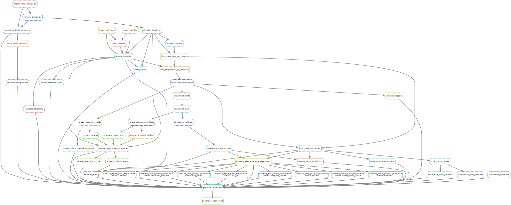

## Amplicon Sequence Analysis Workflow


Build this pipeline based on the Tourmaline via snakemake langugae. I reorganized the structures and added some other plugins for data analysis. Qiime2 platform and snakemake makes the effective and extensible standard workflow be possible.



### Installation 

Before run this pipeline, you should install Qiime2, Snakemake, and some other dependent packages or softwares. All the softwares could be installed by conda commands.

#### install qiime2

I tried use `conda search qiime2` command to find the suitable version, but in fact it failed. Using the configure file from the Qiime2 offical website is the best option. (the following commands just copied from Tourmaline)

```bash
wget https://data.qiime2.org/distro/core/qiime2-2020.8-py36-osx-conda.yml
conda env create -n qiime2-2020.8 --file qiime2-2020.8-py36-osx-conda.yml -y
conda activate qiime2-2020.8
conda install -c bioconda snakemake biopython tabulate pandoc tabview -y 
pip install git+https://github.com/biocore/empress.git
qiime dev refresh-cache
```

#### install R packages

Running R in the linux terminal and then using the *install()* function from the `BiocManger` package to install the dependent packages

```R
packages <- c("msa", "odseq")
BiocManager::install(packages)
```

### Download Reference database 

Compared to greengene, silva could be much better for taxonomic annotation. 

```bash
wget https://data.qiime2.org/2020.8/common/silva-138-99-seqs-515-806.qza
wget https://data.qiime2.org/2020.8/common/silva-138-99-tax-515-806.qza
ln -s silva-138-99-seqs-515-806.qza refseqs.qza
ln -s silva-138-99-tax-515-806.qza reftax.qza
```


###  pipeline directory 

the pipeline comprised of three main parts: **Snakemake file, Rules and Scripts**

```bash
qiime2_dev/
├── config.yaml
├── css
│   ├── github.css
│   ├── gothic.css
│   ├── newsprint.css
│   ├── night.css
│   ├── pixyll.css
│   └── whitey.css
├── manifest.csv
├── metadata.tsv
├── README.md
├── repseqs_to_filter.tsv
├── result
│   ├── 01-import
│   │   ├── paired-end-demux.qza
│   │   ├── refseqs.qza
│   │   └── reftax.qza
│   ├── 02-remove
│   │   └── paired-end-demux-trim.qza
│   ├── 03-denoise
│   │   ├── chimeras.qza
│   │   ├── chimeras_stats.qza
│   │   ├── dada2_stats.qza
│   │   ├── nonchimera.qza
│   │   ├── repseqs_nonchimera.qza
│   │   ├── repseqs.qza
│   │   ├── table_nonchimera.qza
│   │   └── table.qza
│   ├── 04-taxonomy
│   └── logs
│       ├── 02-remove
│       ├── 03-denoise
│       └── 04-taxonomy
├── rules
│   ├── denoise.smk
│   ├── diversity.smk
│   ├── import.smk
│   ├── remove_chimera_contamination.smk
│   ├── remove_primer.smk
│   ├── report.smk
│   ├── summarize_fastq.smk
│   ├── summarize_table.smk
│   ├── taxonomy.smk
│   └── tree.smk
├── scripts
│   ├── create_manifest_from_fastq_directory.py
│   ├── detect_amplicon_locus.py
│   ├── fastaLengths.pl
│   ├── fastqc_per_base_sequence_quality_dropoff.py
│   ├── match_manifest_to_metadata.py
│   └── run_odseq.R
├── Snakefile
├── workflow.svg
└── work.sh

12 directories, 42 files
```


### How to run 

```bash
conda activate qiime2-2020.8
# debug
snakemake -np -r --debug-dag result/03-denoise/table_final.qza --configfile config.yaml --snakefile Snakefile

# wrokflow figure
snakemake --dag --debug-dag result/03-denoise/table_final.qza | dot -Tsvg > workflow.svg

# run
snakemake result/03-denoise/table_final.qza --configfile config.yaml --snakefile Snakefile --cores 2
```